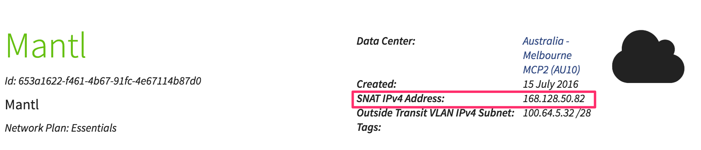

# Rancher on CloudControl

Uses the [Docker Machine driver for CloudControl](https://github.com/DimensionDataResearch/docker-machine-driver-ddcloud) from within Rancher to create nodes.

Cattle, Swarm, and Kubernetes have been verified to work.

## Getting started

To deploy, you will need:

* Terraform v0.7 or higher
* Terraform [ddcloud](https://github.com/DimensionDataResearch/dd-cloud-compute-terraform) provider [v1.1.3 or higher](https://github.com/DimensionDataResearch/dd-cloud-compute-terraform/releases/)
* Ansible v2.0 or higher
* An OSX or Linux client machine  
It might work on Windows, but I haven't tested it. If you have problems, try using Windows 10's Ubuntu on Windows feature or a Linux VM
* An SSH private / public key pair (e.g. `id_rsa` / `id_rsa.pub`)
* Your CloudControl credentials configured in the `MCP_USER` and `MCP_PASSWORD` environment variables
* A tag key called "roles" defined in CloudControl
* A DNS service hosted in AWS Route 53   
*Note* - if you don't want DNS, just delete `terraform/dns.tf` and you're good to go. 

1. Edit [terraform/main.tf](terraform/main.tf) to configure target data center, etc
2. Run `./setup.py` (if you leave the "Client IP" question blank, it will attempt to auto-detect it)  
Note that if you're running these scripts on a server within an MCP network domain, then you may have difficulty contacting ifconfig.co and so you will want to explicitly specify network domain's SNAT (source NAT) address as the client IP:  

3. `cd terraform`
4. `terraform plan`
5. Check that there are no errors and you're happy with the output
6. `terraform apply`
7. `terraform refresh`
8. `terraform output`
9. Note the Rancher and worker host IPs.
10. `cd ../ansible`
11. `ansible-playbook playbooks/upgrade-packages.yml`
12. `ansible-playbook rancher-ddcloud.yml`
13. Open your web browser and navigate to `http://<rancher-host-public-ip>:8080/`
14. Secure your installation of Rancher by going to Admin, then Access-Control, then Local Security
15. Go to Default, then Manage Environments, then click the pencil next to the default environment; choose Kubernetes and press save
15. You can now go to Infrastructure, then Hosts, then Add Hosts.
16. Choose "Something Else", and enter `http://<rancher-host-private-ip>:8080`
17. Choose your orchestrator and either:
  1. Add existing servers (such as the workers created by this example) using the `generic` driver
  2. Add new servers using the `ddcloud` driver

Note that the deployment process added a new SSH keypair to the Rancher container (`/id_rsa` and `/id_rsa.pub`) that can be used by the various Docker Machine drivers.

If you're in a hurry, step 11 is optional, but you're probably better off working with up-to-date packages :)

### Adding hosts

You'll now want to add a couple of hosts to Rancher so you can deploy environments.

1. Go to Environments, then Manage environments.
2. Click the pen on the right of the row for the default environment.
3. Pick your orchestrator at the top of the page.  
If you're not that comfortable with Docker or orchestration yet, try Cattle or Swarm.

For more information, see the [Rancher documentation on hosts](http://docs.rancher.com/rancher/v1.2/en/hosts/).

#### generic driver for Docker Machine

(AF: sorry, haven't automated this yet)

To use the `generic` driver:

1. Go to Admin, then Machine Drivers, then click the play icon inside the box marked `generic`
2. The driver should become active
3. `ssh root@<rancher-host-private-ip>`
4. `cat /root/rancher_keys/id_rsa.pub`
5. Copy the result to the clipboard.
6. `exit`
7. From the `ansible` directory, run `ansible all -m authorized_key -a 'user=root key="<pasted-SSH-public-key>"'`

#### ddcloud driver for Docker Machine

To enable the `ddcloud` driver:

1. Go to Admin, then Machine Drivers, the Add Machine Driver
2. In "Download URL", enter `https://azuretesting2.blob.core.windows.net/public/docker-machine-driver-ddcloud` then click Create.
3. You can now go back to Infrastructure then Hosts
4. If the hosts are being deployed onto the same VLAN as the Rancher host, make sure to the `usePrivateIp` checkbox is checked for each host you add.

## Now what?

For more information, see the [Rancher quick-start guide](http://docs.rancher.com/rancher/v1.2/en/quick-start-guide/#create-a-container-through-ui).

## Troubleshooting

### If you have trouble running Ansible

#### Ansible says "access denied" when trying to connnect to a newly-deployed server

Try connecting to the host manually to see if you get a more informative error message:

```bash
ssh root@host_ip
```

If SSH prompts you for a password, this means the host doesn't recognise your default key as authorised to connect.
Press `Ctrl-C`, and then run:

```bash
ssh -i x/y/x/id_rsa root@host_ip
```

Where `x/y/z/id_rsa` is the folder where your SSH key is located (same path supplied to the question in `setup.py` but without the `.pub` on the end).

### If you already have Rancher deployed

1. `ssh root@<rancher-host-public-ip>`
2. `docker logs -f rancher-server`

If you see errors in the log about shell detection, try changing the image name from "Ubuntu 14.04 2 CPU" to "CentOS 7 64-bit 2 CPU".
